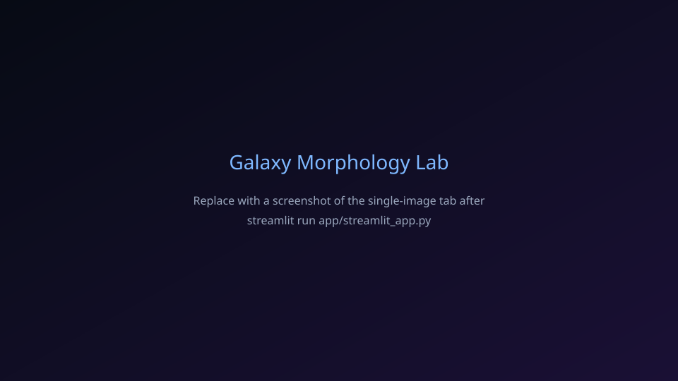

# AI-assisted galaxy morphology analysis system

**Local-first, reproducible PyTorch tooling** for **scalable astronomical workflows**: morphology classification, **optional multi-task** science heads (merger / bar / asymmetry proxies), **rotation-aware training**, **test-time augmentation**, **active-learning exports**, **robustness evaluation**, **dataset characterization**, and **explainability** (Grad-CAM, calibration, MC dropout) — all runnable **without cloud services or paid APIs**.

For a minimal command sequence, see **[QUICKSTART.md](QUICKSTART.md)**.

## Architecture overview

| Layer | Role |
|--------|------|
| **configs/** | Single source of truth for hyperparameters (`train.yaml`, `inference.yaml`). |
| **src/galaxy_morphology/data/** | `Dataset`, loaders, **multi-task manifest**, **dataset quality** JSON, optional SDSS helpers, sample data script. |
| **src/galaxy_morphology/models/** | Custom CNNs (incl. **lightweight_multitask**), torchvision backbones via **registry**. |
| **src/galaxy_morphology/training/** | AMP, grad clip, early stopping, **mixup** (single-task), **multi-task** loop, **weighted CE**, LR schedules, **experiment** dirs. |
| **src/galaxy_morphology/inference/** | Checkpoints, batched inference, **TTA**, optional **ONNX**, throughput benchmark. |
| **src/galaxy_morphology/evaluation/** | Metrics, ROC/PR, **benchmark** table, **scientific robustness** CLI (`galaxy-scientific-eval`). |
| **src/galaxy_morphology/explainability/** | Grad-CAM, MC dropout, calibration, trust report. |
| **src/galaxy_morphology/active_learning/** | JSONL **queue**, **human-review CSV** export, **manifest merge** helpers. |
| **src/galaxy_morphology/analysis/** | **Dataset study** report (class balance, sharpness proxy, augmentation stats). |
| **src/galaxy_morphology/visualization/** | Training curves, confusion matrix, **ROC**, **PR**, **class distribution**. |
| **src/galaxy_morphology/utils/** | YAML merge, structured logging, seeds, checkpoint I/O. |
| **tests/** | pytest smoke tests for model, data, inference, registry, and config loading. |
| **app/** | **Streamlit** local demo (`streamlit_app.py`, `components/`, `assets/`). |

Training flow: **YAML** → **loaders** (optional **rotation augmentation**, optional **multi-task** labels) → **forward + loss** → **validation + extended metrics** → **checkpoints** (`model_name`, `multitask` flag when applicable) → **ROC/PR / trust / robustness artifacts**.

## Setup

**Python 3.10+** recommended.

```bash
# Virtual environment (recommended)
python -m venv .venv
.venv\Scripts\activate          # Windows
# source .venv/bin/activate     # Linux / macOS

# Runtime dependencies
pip install -r requirements/base.txt

# Editable install (adds console commands + stable imports)
pip install -e .

# Optional: developer tools
pip install -r requirements/dev.txt
pre-commit install
```

Console entry points (after `pip install -e .`):

- `galaxy-train` — training CLI  
- `galaxy-infer` — inference CLI  
- `galaxy-sample-data` — dummy or SDSS sample images  
- `galaxy-benchmark` — compare models (CSV + Markdown table)  
- `galaxy-trust-report` — validation trust report (calibration, Grad-CAM, failures, markdown)  
- `galaxy-scientific-eval` — rotation / noise / low-resolution robustness on the val split  
- `galaxy-dataset-study` — markdown dataset characterization (`outputs/dataset_study/report.md`)  
- `galaxy-al-export` — export low-confidence queue to a human-review CSV  

Without installation, use `python scripts/train.py` (scripts prepend `src/` to `sys.path`).

## Science extensions (local)

- **Multi-task training:** set `model.name: lightweight_multitask` and optional `multitask.manifest_csv` (see `docs/example_multitask_manifest.csv`). Auxiliary losses are **masked** when labels are absent.
- **Rotation augmentation:** `data.augmentation.rotation_degrees` in `configs/train.yaml` (train split only).
- **TTA:** `galaxy_morphology.inference.tta.predict_with_rotation_tta` for averaged rotation predictions.
- **Active learning:** append JSONL rows with `galaxy_morphology.active_learning.queue.append_records`, then `galaxy-al-export` for a review CSV; merge completed rows via `merge_review_to_manifest` in `active_learning/merge_manifest.py`.
- **Robustness JSON:** `galaxy-scientific-eval --checkpoint checkpoints/best_model.pth`.
- **Dataset study:** `galaxy-dataset-study` → `outputs/dataset_study/report.md`.
- **Write-up template:** [docs/RESEARCH_REPORT.md](docs/RESEARCH_REPORT.md).

## Quick start

```bash
python scripts/download_sample_data.py --mode dummy --num-per-class 5
python scripts/train.py --config configs/train.yaml --epochs 3
python scripts/inference.py --checkpoint checkpoints/best_model.pth --image data/galaxies/spiral/spiral_1.png
python scripts/benchmark_models.py --data-dir data/galaxies --epochs 1 --out-dir outputs/benchmarks
```

## Model registry and transfer learning

Models are built with **`galaxy_morphology.models.registry.build_model`** (same as **`get_model`** in `model.py` shims).

| `model.name` | Notes |
|--------------|--------|
| `lightweight` | Small custom CNN. |
| `efficient` | MobileNet-style custom CNN. |
| `efficientnet_b0` | torchvision EfficientNet-B0 + new head (`EfficientNet_B0_Weights`). |
| `convnext_tiny` | torchvision ConvNeXt Tiny (`ConvNeXt_Tiny_Weights`). |
| `resnet50` | torchvision ResNet50 (`ResNet50_Weights`). |

Use **`model.pretrained: true`** in `configs/train.yaml` for ImageNet initialization of torchvision backbones. Checkpoints store **`model_name`**, **`scheduler_kind`**, and **`pretrained`** for reproducible resume and inference.

**Tradeoffs:** custom CNNs are fastest for smoke tests and tiny data; ResNet50 / ConvNeXt Tiny are heavier than EfficientNet-B0 at 224² but often give better features when you have enough labels.

## Benchmarking

Fair-ish comparison on the **same stratified split** (`seed`):

```bash
python scripts/benchmark_models.py --data-dir data/galaxies --epochs 1 --out-dir outputs/benchmarks
galaxy-benchmark --models lightweight,efficientnet_b0 --epochs 1 --no-pretrained
```

Writes **`benchmark_results.csv`** and **`benchmark_table.md`** (parameters, val accuracy, macro F1, val-loader throughput, peak GPU memory on CUDA).

## Local experiment tracking

In `configs/train.yaml`:

```yaml
experiment:
  enabled: true
  root: experiments
  slug: ablation_name
```

Creates **`experiments/<UTC>_<slug>/`** with `config_copy.yaml`, `config_resolved.json`, per-epoch **`metrics.jsonl`**, `outputs/`, `checkpoints/`, and `figures/` (ROC, PR, confusion matrix, class distribution). No cloud tracking.

## Dataset quality

With `data.quality.enabled: true` (default), training writes **`outputs/dataset_statistics.json`**: per-class counts, files that fail `PIL` open/verify, **MD5 duplicate** path groups, and simple **imbalance** warnings.

## Training

1. Put images under `data/galaxies/<class>/` with classes `spiral`, `elliptical`, `irregular` (see `configs/train.yaml` → `data.dir`).
2. Edit hyperparameters in **`configs/train.yaml`** (epochs, LR, AMP, early stopping, checkpoint cadence, etc.).
3. Run:

```bash
galaxy-train --config configs/train.yaml
# or
python train.py --config configs/train.yaml
```

**CLI overrides** (optional) merge into the YAML tree, for example:

```bash
python scripts/train.py --config configs/train.yaml --data-dir data/galaxies --epochs 20 --batch-size 16 --lr 0.0005 --model efficientnet_b0
```

**Resume** from a checkpoint:

```bash
python scripts/train.py --config configs/train.yaml --resume checkpoints/checkpoint_epoch_10.pth
```

Training uses:

- **Mixed precision** (`torch.amp`) when CUDA is available (`training.amp`).
- **Gradient clipping** (`training.gradient_clip_norm`).
- **AdamW** optimizer; **ReduceLROnPlateau** or **cosine** schedule (`scheduler.type`: `plateau` or `cosine`).
- **Class-weighted** cross-entropy (`training.loss.weighted`), **label smoothing** (`training.loss.label_smoothing`).
- **Mixup** (`training.mixup.enabled`, `training.mixup.alpha`).
- **Early stopping** (`training.early_stopping`); `patience: 0` disables.
- **Periodic checkpoints** with full optimizer/scheduler/scaler state.
- **`torch.load(..., map_location=device)`** via `load_checkpoint` for resume and final eval.

## Inference

Edit **`configs/inference.yaml`** or pass flags:

```bash
galaxy-infer --checkpoint checkpoints/best_model.pth --image path/to/galaxy.jpg
galaxy-infer --checkpoint checkpoints/best_model.pth --image-dir path/to/folder/ --batch-size 32 --output predictions.csv --benchmark
galaxy-infer --checkpoint checkpoints/best_model.pth --onnx-export model.onnx
```

Directory mode uses a **DataLoader** for batched GPU inference. **`--benchmark`** logs images/sec after predictions. **`--onnx-export`** writes a dynamic-batch ONNX graph (opset 17; uses the non-Dynamo exporter when available).

The checkpoint’s `class_names` (and optional `model_name`) define outputs.

### Explainable inference (single image)

Uses the maintained **[grad-cam](https://github.com/jacobgil/pytorch-grad-cam)** package (`pytorch_grad_cam`) for overlays and side-by-side figures—no custom Grad-CAM forks.

```bash
galaxy-infer --checkpoint checkpoints/best_model.pth --image path/to/galaxy.jpg --explain --explain-out outputs/visualizations/inference
```

Writes overlay + comparison PNGs under `--explain-out`, prints **top-3** probabilities, **Monte Carlo dropout** summary (mean confidence, normalized entropy uncertainty, `needs_human_review` flag), and Grad-CAM paths.

## Streamlit demo (local UI)

A minimal **Streamlit** app lives under **`app/`**: single-image upload with **top-3** and **Grad-CAM**, **MC dropout** uncertainty with a confidence bar and **human-review** notice, plus **batch** inference from a **ZIP** or multi-file upload with **CSV** download. The model is loaded once per session via **`st.cache_resource`**; identical single-image runs are memoized in **session state**. Default sidebar option **Force CPU** keeps execution laptop-friendly.

**Install demo dependency (Streamlit only):**

```bash
pip install -e ".[demo]"
# or: pip install -r requirements/demo.txt && pip install -e .
```

**Run (from repository root):**

```bash
streamlit run app/streamlit_app.py
```

Theme and layout are tuned in **`.streamlit/config.toml`** and **`app/components/theme.py`** (dark “night sky” palette, no extra frontend stack).

### Demo screenshots (placeholders)

| Single-image + explainability | Batch + CSV |
|-------------------------------|---------------|
|  |  |

Commit your own PNG/SVG captures over these placeholders under **`app/assets/screenshots/`** for documentation.

### GIF walkthrough

Record a short screen capture while you walk through **sidebar checkpoint → single image → Analyze → Batch tab → CSV download**, then save it as **`app/assets/walkthrough.gif`** and link it here:

```markdown

```

## Trustworthy AI (validation report)

Automated **markdown report** plus figures under **`outputs/visualizations/`** (calibration, confusion matrix, failure montages, example Grad-CAMs):

```bash
galaxy-trust-report --checkpoint checkpoints/best_model.pth --data-dir data/galaxies --out-dir outputs/visualizations
```

This computes **validation accuracy / macro F1**, **expected calibration error (ECE)** on top-class confidence, a **reliability diagram**, a **confusion matrix** image, three **failure-analysis** montages (most confident wrong, least confident correct, lowest-confidence samples), **MC-dropout aggregate stats** on the first `--mc-subset` validation images (default 48), and **Grad-CAM** panels for the first `--gradcam-examples` images (default 4). Open **`outputs/visualizations/evaluation_report.md`** in any Markdown viewer; figures are linked with relative paths.

**Grad-CAM / explanation screenshots for documentation:** run the commands above on your checkpoint, then add the generated PNGs (for example `outputs/visualizations/gradcam/*_gradcam_compare.png`) to your paper, slides, or commit copies under `docs/figures/` if you want them to render in Git-hosted README previews.

## Metrics and artifacts

After training you typically get:

| Artifact | Location |
|----------|-----------|
| Best weights | `checkpoints/best_model.pth` (and periodic `checkpoint_epoch_*.pth`) |
| Training / validation curves | `outputs/training_history.png`, or `experiments/.../figures/` when experiment mode is on |
| Confusion matrix | `outputs/confusion_matrix.png` (or experiment `figures/`) |
| ROC / PR curves | `outputs/roc_curves.png`, `outputs/pr_curves.png` (or experiment `figures/`) |
| Class distribution | `outputs/class_distribution_train.png` (or experiment `figures/`) |
| Run-level metrics | `outputs/metrics.json` (includes **extended** block: macro/weighted F1, balanced acc, ROC-AUC OvR) |
| Extended metrics JSON | `outputs/extended_metrics.json` |
| Per-class sklearn report | `outputs/classification_report.json` |
| Trust / explainability report | `outputs/visualizations/evaluation_report.md` (after `galaxy-trust-report`) |
| Grad-CAM & calibration figures | `outputs/visualizations/gradcam/`, `calibration/`, `failure/`, `confusion/` |
| ROC/PR raw points | `outputs/roc_curve_data.json`, `outputs/pr_curve_data.json` |
| Per-epoch CSV | `outputs/training_history.csv` |
| Dataset quality | `outputs/dataset_statistics.json` |

## Reproducibility

- Global seed: `seed` in `configs/train.yaml`.
- `galaxy_morphology.utils.seed.set_seed` sets Python, NumPy, and PyTorch seeds; optional **deterministic cuDNN** (`reproducibility.deterministic_cudnn`).
- Stratified split uses `random_state=seed`; `DataLoader` shuffling uses a fixed `torch.Generator` when possible.

Some GPU kernels remain non-deterministic even with these flags; for strict bitwise reproducibility prefer CPU or consult PyTorch deterministic ops notes.

## Project structure

```text
configs/                 # YAML configs
app/                     # Streamlit demo (streamlit_app.py, components/, assets/)
src/galaxy_morphology/   # Installable Python package
  data/ models/ training/ inference/ evaluation/ explainability/ visualization/ utils/
scripts/                 # Runnable wrappers without prior pip install
tests/                   # pytest
notebooks/               # Optional experiments (.gitkeep)
outputs/                 # metrics, plots (no experiment), CSV (.gitkeep)
checkpoints/             # saved weights (.gitkeep)
experiments/             # local experiment dirs when enabled (.gitkeep)
requirements/            # base.txt, dev.txt, demo.txt
pyproject.toml           # packaging, black/ruff/pytest settings
setup.cfg                # setuptools metadata
README.md
LICENSE                  # MIT
```

## Development

```bash
pip install -r requirements/dev.txt
pytest
ruff check src tests scripts app
black src tests scripts app
```

## Data sources (external, public)

- [Galaxy Zoo](https://data.galaxyzoo.org/)  
- [SDSS](https://www.sdss.org/)  

## License

MIT — see [LICENSE](LICENSE).
